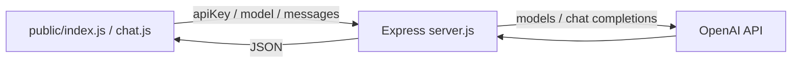

# GPT 웹 챗봇

[웹 데모](https://chatbot-project-made-by-hazyala.onrender.com/)

브라우저에서 모델과 API 키를 입력하고 Express가 OpenAI 요청을 중계하는 대화 화면.

## 요청 흐름



`server.js`는 public 폴더를 정적으로 제공한다. 브라우저의 대화 이력을 request body로 받고 JSON 응답을 돌려준다. 토큰 스트리밍은 없다. package.json에 Redis·session·rate-limit·OpenAI SDK가 선언되어 있지만 현재 server는 Express와 node-fetch를 직접 사용하며 해당 미들웨어를 등록하지 않았다.

## API

| Method | Endpoint | JSON 입력 | 응답 |
|---|---|---|---|
| POST | `/verify-key` | apiKey, model | success=true 또는 success=false/message |
| POST | `/chat` | apiKey, model, messages 배열 | success와 upstream payload, servedModel |

verify-key는 OpenAI 모델 목록 요청으로 키를 검사하며 선택 모델의 응답 가능성까지 보증하지 않는다. chat은 `/v1/chat/completions`를 호출하고 upstream 오류 상태를 전달한다. 필수 필드 오류는 400, verify-key upstream 실패는 401, 네트워크 예외는 500이다. 자체 로그인 인증은 없다.

기존 README의 “키를 세션에 안전하게 저장” 설명과 달리 서버는 매 요청의 키를 사용한다. 브라우저는 `sessionStorage`에 키와 모델을 보관하고 `public/chat.js`가 요청마다 보낸다. 서버 세션·Redis 저장이 구현된 것으로 소개하지 않는다.

## 실행과 현재 장애

package.json의 Node 요구사항은 18 이상이다. 이 폴더에서 의존성을 설치한다.

```bash
npm ci
npm start
```

현재 `server.js`에 `app.listen(PORT)`가 두 번 있어 그대로 실행하면 포트 중복 오류가 발생할 수 있다. 기본 PORT는 10000이며 기존 README의 3000과 다르다.

`npm run dev`는 nodemon, `npm test`는 실패를 출력하는 placeholder다. 자동 테스트로 안내하지 않는다. 서버 환경변수는 `PORT`를 읽는다. API 키는 화면에서 입력하며 dotenv 자동 로딩은 현재 server에 없다.

Render 배포 주소는 상단 링크에 있다. 현재 저장소를 재배포하려면 위의 중복 `app.listen(PORT)` 문제를 먼저 수정해야 한다.
